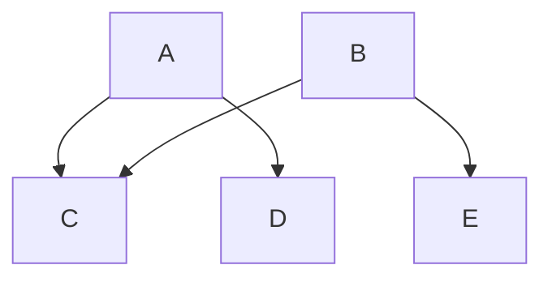
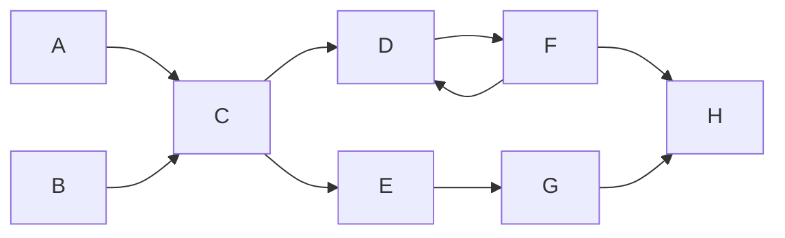
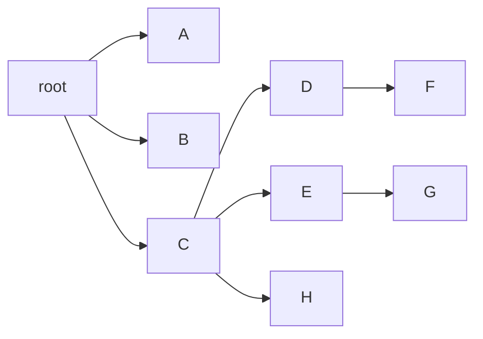

# 5.类加载

## 对象访存

### 存储结构

一个 Java 对象内存中存储为三部分：对象头（Header）、实例数据（Instance Data）和对齐填充 （Padding）

对象头：

* 普通对象：分为两部分

  * **Mark Word**：用于存储对象自身的运行时数据， 如哈希码（HashCode）、GC 分代年龄、锁状态标志、线程持有的锁、偏向线程ID、偏向时间戳等等

    ```ruby
    hash(25) + age(4) + lock(3) = 32bit					#32位系统
    unused(25+1) + hash(31) + age(4) + lock(3) = 64bit	#64位系统
    ```

  * **Klass Word**：类型指针，**指向该对象的 Class 类对象的指针**，虚拟机通过这个指针来确定这个对象是哪个类的实例；在 64 位系统中，开启指针压缩（-XX:+UseCompressedOops）或者 JVM 堆的最大值小于 32G，这个指针也是 4byte，否则是 8byte（就是 **Java 中的一个引用的大小**）

  ```ruby
  |-----------------------------------------------------|
  | 				  Object Header (64 bits) 			  |
  |---------------------------|-------------------------|
  | 	 Mark Word (32 bits)	|  Klass Word (32 bits)   |
  |---------------------------|-------------------------|
  ```

* 数组对象：如果对象是一个数组，那在对象头中还有一块数据用于记录数组长度（12 字节）

  ```ruby
  |-------------------------------------------------------------------------------|
  | 						  Object Header (96 bits) 							    |
  |-----------------------|-----------------------------|-------------------------|
  |  Mark Word(32bits)    | 	  Klass Word(32bits) 	  |   array length(32bits)  |
  |-----------------------|-----------------------------|-------------------------|
  ```

实例数据：实例数据部分是对象真正存储的有效信息，也是在程序代码中所定义的各种类型的字段内容，无论是从父类继承下来的，还是在子类中定义的，都需要记录起来

对齐填充：Padding 起占位符的作用。64 位系统，由于 HotSpot VM 的自动内存管理系统要求**对象起始地址必须是 8 字节的整数倍**，就是对象的大小必须是 8 字节的整数倍，而对象头部分正好是 8 字节的倍数（1 倍或者 2 倍），因此当对象实例数据部分没有对齐时，就需要通过对齐填充来补全

32 位系统：

* 一个 int 在 java 中占据 4byte，所以 Integer 的大小为：

  ```java
  private final int value;
  ```

  ```ruby
  ## 需要补位4byte
  4(Mark Word) + 4(Klass Word) + 4(data) + 4(Padding) = 16byte
  ```

* `int[] arr = new int[10]`

  ```ruby
  ## 由于需要8位对齐，所以最终大小为56byte
  4(Mark Word) + 4(Klass Word) + 4(length) + 4*10(10个int大小) + 4(Padding) = 56sbyte
  ```

### 实际大小 ·

浅堆（Shallow Heap）：**对象本身占用的内存，不包括内部引用对象的大小**，32 位系统中一个对象引用占 4 个字节，每个对象头占用 8 个字节，根据堆快照格式不同，对象的大小会同 8 字节进行对齐

JDK7 中的 String：2个 int 值共占 8 字节，value 对象引用占用 4 字节，对象头 8 字节，对齐后占 24 字节，为 String 对象的浅堆大小，与 value 实际取值无关，无论字符串长度如何，浅堆大小始终是 24 字节

```java
private final char value[];
private int hash;
private int hash32;
```

保留集（Retained Set）：对象 A 的保留集指当对象 A 被垃圾回收后，可以被释放的所有的对象集合（包括 A 本身），所以对象 A 的保留集就是只能通过对象 A 被直接或间接访问到的所有对象的集合，就是仅被对象 A 所持有的对象的集合

深堆（Retained Heap）：指对象的保留集中所有的对象的浅堆大小之和，一个对象的深堆指只能通过该对象访问到的（直接或间接）所有对象的浅堆之和，即对象被回收后，可以释放的真实空间

对象的实际大小：一个对象所能触及的所有对象的浅堆大小之和，也就是通常意义上我们说的对象大小

下图显示了一个简单的对象引用关系图，对象 A 引用了 C 和 D，对象 B 引用了 C 和 E。那么对象 A 的浅堆大小只是 A 本身，**A 的实际大小为 A、C、D 三者之和**，A 的深堆大小为 A 与 D 之和，由于对象 C 还可以通过对象 B 访问到 C，因此 C 不在对象 A 的深堆范围内



内存分析工具 MAT 提供了一种叫支配树的对象图，体现了对象实例间的支配关系

基本性质：

- 对象 A 的子树（所有被对象 A 支配的对象集合）表示对象 A 的保留集（retained set），即深堆
- 如果对象 A 支配对象 B，那么对象 A 的直接支配者也支配对象 B
- 支配树的边与对象引用图的边不直接对应

引用图：


支配树：



比如：对象 F 与对象 D 相互引用，因为到对象 F 的所有路径必然经过对象 D，因此对象 D 是对象 F 的直接支配者

### 节约内存

* 尽量使用基本数据类型

* 满足容量前提下，尽量用小字段

* 尽量用数组，少用集合，数组中是可以使用基本类型的，但是集合中只能放包装类型，如果需要使用集合，推荐比较节约内存的集合工具：fastutil

  一个 ArrayList 集合，如果里面放了 10 个数字，占用多少内存：

  ```java
  private transient Object[] elementData;
  private int size;
  ```

  Mark Word 占 4byte，Klass Word 占 4byte，一个 int 字段占 4byte，elementData 数组占 12byte，数组中 10 个 Integer 对象占 10×16，所以整个集合空间大小为 184byte（深堆）

* 时间用 long/int 表示，不用 Date 或者 String

### 对象访问

JVM 是通过**栈帧中的对象引用**访问到其内部的对象实例：

* 句柄访问：Java 堆中会划分出一块内存来作为句柄池，reference 中存储的就是对象的句柄地址，而句柄中包含了对象实例数据和类型数据各自的具体地址信息
  
  优点：reference 中存储的是稳定的句柄地址，在对象被移动（垃圾收集）时只会改变句柄中的实例数据指针，而 reference 本身不需要被修改

  

* 直接指针（HotSpot 采用）：Java 堆对象的布局必须考虑如何放置访问类型数据的相关信息，reference 中直接存储的对象地址
  
  优点：速度更快，**节省了一次指针定位的时间开销**

  缺点：对象被移动时（如进行 GC 后的内存重新排列），对象的 reference 也需要同步更新
  
  

## 对象创建

### 生命周期

在 Java 中，对象的生命周期包括以下几个阶段：

1.      创建阶段 (Created)：
2.      应用阶段 (In Use)：对象至少被一个强引用持有着
3.      不可见阶段 (Invisible)：程序的执行已经超出了该对象的作用域，不再持有该对象的任何强引用
4.      不可达阶段 (Unreachable)：该对象不再被任何强引用所持有，包括 GC Root 的强引用
5.      收集阶段 (Collected)：垃圾回收器对该对象的内存空间重新分配做好准备，该对象如果重写了 finalize() 方法，则会去执行该方法
6.      终结阶段 (Finalized)：等待垃圾回收器对该对象空间进行回收，当对象执行完 finalize() 方法后仍然处于不可达状态时进入该阶段
7.      对象空间重分配阶段 (De-allocated)：垃圾回收器对该对象的所占用的内存空间进行回收或者再分配

### 创建时机

类在第一次实例化加载一次，后续实例化不再加载，引用第一次加载的类

Java 对象创建时机：

1. 使用 new 关键字创建对象：由执行类实例创建表达式而引起的对象创建

2. 使用 Class 类的 newInstance 方法（反射机制）

3. 使用 Constructor 类的 newInstance 方法（反射机制）

   ```java
   public class Student {
       private int id;
       public Student(Integer id) {
           this.id = id;
       }
       public static void main(String[] args) throws Exception {
           Constructor<Student> c = Student.class.getConstructor(Integer.class);
           Student stu = c.newInstance(123);
       }
   }
   ```

   使用 newInstance 方法的这两种方式创建对象使用的就是 Java 的反射机制，事实上 Class 的 newInstance 方法内部调用的也是 Constructor 的 newInstance 方法

4. 使用 Clone 方法创建对象：用 clone 方法创建对象的过程中并不会调用任何构造函数，要想使用 clone 方法，我们就必须先实现 Cloneable 接口并实现其定义的 clone 方法

5. 使用（反）序列化机制创建对象：当反序列化一个对象时，JVM 会创建一个**单独的对象**，在此过程中，JVM 并不会调用任何构造函数，为了反序列化一个对象，需要让类实现 Serializable 接口

从 Java 虚拟机层面看，除了使用 new 关键字创建对象的方式外，其他方式全部都是通过转变为 invokevirtual 指令直接创建对象的

### 创建过程

创建对象的过程：

1. 判断对象对应的类是否加载、链接、初始化

2. 为对象分配内存：指针碰撞、空闲链表。当一个对象被创建时，虚拟机就会为其分配内存来存放对象的实例变量及其从父类继承过来的实例变量，即使从**隐藏变量**也会被分配空间（继承部分解释了为什么会隐藏）

3. 处理并发安全问题：

   * 采用 CAS 配上自旋保证更新的原子性
   * 每个线程预先分配一块 TLAB

4. 初始化分配的空间：虚拟机将分配到的内存空间都初始化为零值（不包括对象头），保证对象实例字段在不赋值时可以直接使用，程序能访问到这些字段的数据类型所对应的零值

5. 设置对象的对象头：将对象的所属类（类的元数据信息）、对象的 HashCode、对象的 GC 信息、锁信息等数据存储在对象头中

6. 执行 init 方法进行实例化：实例变量初始化、实例代码块初始化 、构造函数初始化

   * 实例变量初始化与实例代码块初始化：

     对实例变量直接赋值或者使用实例代码块赋值，**编译器会将其中的代码放到类的构造函数中去**，并且这些代码会被放在对超类构造函数的调用语句之后（Java 要求构造函数的第一条语句必须是超类构造函数的调用语句），构造函数本身的代码之前

   * 构造函数初始化：

     **Java 要求在实例化类之前，必须先实例化其超类，以保证所创建实例的完整性**，在准备实例化一个类的对象前，首先准备实例化该类的父类，如果该类的父类还有父类，那么准备实例化该类的父类的父类，依次递归直到递归到 Object 类。然后从 Object 类依次对以下各类进行实例化，初始化父类中的变量和执行构造函数

### 承上启下

1. 一个实例变量在对象初始化的过程中会被赋值几次？一个实例变量最多可以被初始化 4 次

   JVM 在为一个对象分配完内存之后，会给每一个实例变量赋予默认值，这个实例变量被第一次赋值；在声明实例变量的同时对其进行了赋值操作，那么这个实例变量就被第二次赋值；在实例代码块中又对变量做了初始化操作，那么这个实例变量就被第三次赋值；；在构造函数中也对变量做了初始化操作，那么这个实例变量就被第四次赋值

2. 类的初始化过程与类的实例化过程的异同？

   类的初始化是指类加载过程中的初始化阶段对类变量按照代码进行赋值的过程；类的实例化是指在类完全加载到内存中后创建对象的过程（类的实例化触发了类的初始化，先初始化才能实例化）

3. 假如一个类还未加载到内存中，那么在创建一个该类的实例时，具体过程是怎样的？（**经典案例**）

   ```java
   public class StaticTest {
       public static void main(String[] args) {
           staticFunction();//调用静态方法，触发初始化
       }
   
       static StaticTest st = new StaticTest();
   
       static {   //静态代码块
           System.out.println("1");
       }
   
       {       // 实例代码块
           System.out.println("2");
       }
   
       StaticTest() {    // 实例构造器
           System.out.println("3");
           System.out.println("a=" + a + ",b=" + b);
       }
   
       public static void staticFunction() {   // 静态方法
           System.out.println("4");
       }
   
       int a = 110;    		// 实例变量
       static int b = 112;     // 静态变量
   }/* Output: 
           2
           3
           a=110,b=0
           1
           4
    *///:~
   ```

   `static StaticTest st = new StaticTest();`：

   * 实例实例化不一定要在类初始化结束之后才开始

   * 在同一个类加载器下，一个类型只会被初始化一次。所以一旦开始初始化一个类，无论是否完成后续都不会再重新触发该类型的初始化阶段了（只考虑在同一个类加载器下的情形）。因此在实例化上述程序中的 st 变量时，**实际上是把实例化嵌入到了静态初始化流程中，并且在上面的程序中，嵌入到了静态初始化的起始位置**，这就导致了实例初始化完全发生在静态初始化之前，这也是导致 a 为 110，b 为 0 的原因

   代码等价于：

   ```java
   public class StaticTest {
       <clinit>(){
           a = 110;    // 实例变量
           System.out.println("2");	// 实例代码块
           System.out.println("3");	// 实例构造器中代码的执行
           System.out.println("a=" + a + ",b=" + b);  // 实例构造器中代码的执行
           类变量st被初始化
           System.out.println("1");	//静态代码块
           类变量b被初始化为112
       }
   }
   ```


## 加载过程

### 生命周期

类是在运行期间**第一次使用时动态加载**的（不使用不加载），而不是一次性加载所有类，因为一次性加载会占用很多的内存，加载的类信息存放于一块成为方法区的内存空间


包括 7 个阶段：

* 加载（Loading）
* 链接：验证（Verification）、准备（Preparation）、解析（Resolution）
* 初始化（Initialization）
* 使用（Using）
* 卸载（Unloading）

### 加载阶段

加载是类加载的其中一个阶段，注意不要混淆

加载过程完成以下三件事：

- 通过类的完全限定名称获取定义该类的二进制字节流（二进制字节码）
- 将该字节流表示的静态存储结构转换为方法区的运行时存储结构（Java 类模型）
- **将字节码文件加载至方法区后，在堆中生成一个代表该类的 Class 对象，作为该类在方法区中的各种数据的访问入口**

其中二进制字节流可以从以下方式中获取：

- 从 ZIP 包读取，成为 JAR、EAR、WAR 格式的基础
- 从网络中获取，最典型的应用是 Applet
- 由其他文件生成，例如由 JSP 文件生成对应的 Class 类
- 运行时计算生成，例如动态代理技术，在 java.lang.reflect.Proxy 使用 ProxyGenerator.generateProxyClass 生成字节码

方法区内部采用 C++ 的 instanceKlass 描述 Java 类的数据结构：

* `_java_mirror` 即 Java 的类镜像，例如对 String 来说就是 String.class，作用是把 class 暴露给 Java 使用
* `_super` 即父类、`_fields` 即成员变量、`_methods` 即方法、`_constants` 即常量池、`_class_loader` 即类加载器、`_vtable` **虚方法表**、`_itable` 接口方法表

加载过程：

* 如果这个类还有父类没有加载，先加载父类
* 加载和链接可能是交替运行的
* Class 对象和 _java_mirror 相互持有对方的地址，堆中对象通过 instanceKlass 和元空间进行交互


创建数组类有些特殊，因为数组类本身并不是由类加载器负责创建，而是由 JVM 在运行时根据需要而直接创建的，但数组的元素类型仍然需要依靠类加载器去创建，创建数组类的过程：

- 如果数组的元素类型是引用类型，那么遵循定义的加载过程递归加载和创建数组的元素类型
- JVM 使用指定的元素类型和数组维度来创建新的数组类
- **基本数据类型由启动类加载器加载**

### 链接阶段

#### 验证

确保 Class 文件的字节流中包含的信息是否符合 JVM 规范，保证被加载类的正确性，不会危害虚拟机自身的安全

主要包括**四种验证**：

* 文件格式验证

* 语义检查，但凡在语义上不符合规范的，虚拟机不会给予验证通过

  * 是否所有的类都有父类的存在（除了 Object 外，其他类都应该有父类）

  * 是否一些被定义为 final 的方法或者类被重写或继承了

  * 非抽象类是否实现了所有抽象方法或者接口方法

  * 是否存在不兼容的方法

* 字节码验证，试图通过对字节码流的分析，判断字节码是否可以被正确地执行

  * 在字节码的执行过程中，是否会跳转到一条不存在的指令
  * 函数的调用是否传递了正确类型的参数
  * 变量的赋值是不是给了正确的数据类型
  * 栈映射帧（StackMapTable）在这个阶段用于检测在特定的字节码处，其局部变量表和操作数栈是否有着正确的数据类型

* 符号引用验证，Class 文件在其常量池会通过字符串记录将要使用的其他类或者方法

#### 准备

准备阶段为**静态变量（类变量）分配内存并设置初始值**，使用的是方法区的内存：

说明：实例变量不会在这阶段分配内存，它会在对象实例化时随着对象一起被分配在堆中，类加载发生在所有实例化操作之前，并且类加载只进行一次，实例化可以进行多次

类变量初始化：

* static 变量分配空间和赋值是两个步骤：**分配空间在准备阶段完成，赋值在初始化阶段完成**
* 如果 static 变量是 final 的基本类型以及字符串常量，那么编译阶段值（方法区）就确定了，准备阶段会显式初始化
* 如果 static 变量是 final 的，但属于引用类型或者构造器方法的字符串，赋值在初始化阶段完成

实例：

* 初始值一般为 0 值，例如下面的类变量 value 被初始化为 0 而不是 123：

  ```java
  public static int value = 123;
  ```

* 常量 value 被初始化为 123 而不是 0：

  ```java
  public static final int value = 123;
  ```

* Java 并不支持 boolean 类型，对于 boolean 类型，内部实现是 int，由于 int 的默认值是 0，故 boolean 的默认值就是 false

#### 解析

将常量池中类、接口、字段、方法的**符号引用替换为直接引用**（内存地址）的过程：

* 符号引用：一组符号来描述目标，可以是任何字面量，属于编译原理方面的概念，如：包括类和接口的全限名、字段的名称和描述符、方法的名称和**方法描述符**（因为类还没有加载完，很多方法是找不到的）
* 直接引用：直接指向目标的指针、相对偏移量或一个间接定位到目标的句柄，如果有了直接引用，那说明引用的目标必定已经存在于内存之中

例如：在 `com.demo.Solution` 类中引用了 `com.test.Quest`，把 `com.test.Quest` 作为符号引用存进类常量池，在类加载完后，**用这个符号引用去方法区找这个类的内存地址**

解析动作主要针对类或接口、字段、类方法、接口方法、方法类型等

* 在类加载阶段解析的是非虚方法，静态绑定
* 也可以在初始化阶段之后再开始解析，这是为了支持 Java 的**动态绑定**
* 通过解析操作，符号引用就可以转变为目标方法在类的虚方法表中的位置，从而使得方法被成功调用

```java
public class Load2 {
    public static void main(String[] args) throws Exception{
    ClassLoader classloader = Load2.class.getClassLoader();
    // cloadClass 加载类方法不会导致类的解析和初始化，也不会加载D
    Class<?> c = classloader.loadClass("cn.jvm.t3.load.C");
        
    // new C();会导致类的解析和初始化，从而解析初始化D
    System.in.read();
    }
}
class C {
	D d = new D();
}
class D {
}
```

### 初始化

#### 介绍

初始化阶段才真正开始执行类中定义的 Java 程序代码，在准备阶段，类变量已经赋过一次系统要求的初始值；在初始化阶段，通过程序制定的计划去初始化类变量和其它资源，执行 <clinit>

在编译生成 class 文件时，编译器会产生两个方法加于 class 文件中，一个是类的初始化方法 clinit，另一个是实例的初始化方法 init

类构造器 <clinit>() 与实例构造器 <init>() 不同，它不需要程序员进行显式调用，在一个类的生命周期中，类构造器最多被虚拟机**调用一次**，而实例构造器则会被虚拟机调用多次，只要程序员创建对象

类在第一次实例化加载一次，把 class 读入内存，后续实例化不再加载，引用第一次加载的类

#### clinit

<clinit>()：类构造器，由编译器自动收集类中**所有类变量的赋值动作和静态语句块**中的语句合并产生的

作用：是在类加载过程中的初始化阶段进行静态变量初始化和执行静态代码块

* 如果类中没有静态变量或静态代码块，那么 clinit 方法将不会被生成
* clinit 方法只执行一次，在执行 clinit 方法时，必须先执行父类的clinit方法
* static 变量的赋值操作和静态代码块的合并顺序由源文件中出现的顺序决定
* static 不加 final 的变量都在初始化环节赋值

**线程安全**问题：

* 虚拟机会保证一个类的 <clinit>() 方法在多线程环境下被正确的加锁和同步，如果多个线程同时初始化一个类，只会有一个线程执行这个类的 <clinit>() 方法，其它线程都阻塞等待，直到活动线程执行 <clinit>() 方法完毕
* 如果在一个类的 <clinit>() 方法中有耗时的操作，就可能造成多个线程阻塞，在实际过程中此种阻塞很隐蔽

特别注意：静态语句块只能访问到定义在它之前的类变量，定义在它之后的类变量只能赋值，不能访问

```java
public class Test {
    static {
        //i = 0;                // 给变量赋值可以正常编译通过
        System.out.print(i);  	// 这句编译器会提示“非法向前引用”
    }
    static int i = 1;
}
```

接口中不可以使用静态语句块，但仍然有类变量初始化的赋值操作，因此接口与类一样都会生成 <clinit>() 方法，两者不同的是：

* 在初始化一个接口时，并不会先初始化它的父接口，所以执行接口的 <clinit>() 方法不需要先执行父接口的 <clinit>() 方法
* 在初始化一个类时，不会先初始化所实现的接口，所以接口的实现类在初始化时不会执行接口的 <clinit>() 方法
* 只有当父接口中定义的变量使用时，父接口才会初始化

#### 时机

类的初始化是懒惰的，只有在首次使用时才会被装载，JVM 不会无条件地装载 Class 类型，Java 虚拟机规定，一个类或接口在初次使用前，必须要进行初始化

**主动引用**：虚拟机规范中并没有强制约束何时进行加载，但是规范严格规定了有且只有下列情况必须对类进行初始化（加载、验证、准备都会发生）：

* 当创建一个类的实例时，使用 new 关键字，或者通过反射、克隆、反序列化（前文讲述的对象的创建时机）
* 当调用类的静态方法或访问静态字段时，遇到 getstatic、putstatic、invokestatic 这三条字节码指令，如果类没有进行过初始化，则必须先触发其初始化
  * getstatic：程序访问类的静态变量（不是静态常量，常量会被加载到运行时常量池）
  * putstatic：程序给类的静态变量赋值
  * invokestatic ：调用一个类的静态方法
* 使用 java.lang.reflect 包的方法对类进行反射调用时，如果类没有进行初始化，则需要先触发其初始化
* 当初始化一个类的时候，如果发现其父类还没有进行过初始化，则需要先触发其父类的初始化，但这条规则并**不适用于接口**
* 当虚拟机启动时，需要指定一个要执行的主类（包含 main() 方法的那个类），虚拟机会先初始化这个主类
* MethodHandle 和 VarHandle 可以看作是轻量级的反射调用机制，而要想使用这两个调用， 就必须先使用 findStaticVarHandle 来初始化要调用的类
* 补充：当一个接口中定义了 JDK8 新加入的默认方法（被 default 关键字修饰的接口方法）时，如果有这个接口的实现类发生了初始化，那该接口要在其之前被初始化

**被动引用**：所有引用类的方式都不会触发初始化，称为被动引用

* 通过子类引用父类的静态字段，不会导致子类初始化，只会触发父类的初始化
* 通过数组定义来引用类，不会触发此类的初始化。该过程会对数组类进行初始化，数组类是一个由虚拟机自动生成的、直接继承自 Object 的子类，其中包含了数组的属性和方法
* 常量（final 修饰）在编译阶段会存入调用类的常量池中，本质上没有直接引用到定义常量的类，因此不会触发定义常量的类的初始化
* 调用 ClassLoader 类的 loadClass() 方法加载一个类，并不是对类的主动使用，不会导致类的初始化

#### init

init 指的是实例构造器，主要作用是在类实例化过程中执行，执行内容包括成员变量初始化和代码块的执行

实例化即调用 <init>()V ，虚拟机会保证这个类的构造方法的线程安全，先为实例变量分配内存空间，再执行赋默认值，然后根据源码中的顺序执行赋初值或代码块，没有成员变量初始化和代码块则不会执行

类实例化过程：**父类的类构造器<clinit>() -> 子类的类构造器<clinit>() -> 父类的成员变量和实例代码块 -> 父类的构造函数 -> 子类的成员变量和实例代码块 -> 子类的构造函数**

new 关键字会创建对象并复制 dup 一个对象引用，一个调用 <init> 方法，另一个用来赋值给接收者

### 卸载阶段

时机：执行了 System.exit() 方法，程序正常执行结束，程序在执行过程中遇到了异常或错误而异常终止，由于操作系统出现错误而导致Java 虚拟机进程终止

卸载类即该类的 **Class 对象被 GC**，卸载类需要满足3个要求:

1. 该类的所有的实例对象都已被 GC，也就是说堆不存在该类的实例对象
2. 该类没有在其他任何地方被引用
3. 该类的类加载器的实例已被 GC，一般是可替换类加载器的场景，如 OSGi、JSP 的重加载等，很难达成

在 JVM 生命周期类，由 JVM 自带的类加载器加载的类是不会被卸载的，自定义的类加载器加载的类是可能被卸载。因为 JVM 会始终引用启动、扩展、系统类加载器，这些类加载器始终引用它们所加载的类，这些类始终是可及的
